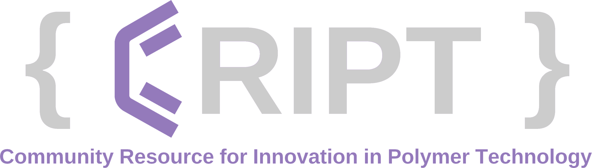

**CRIPT** (the _Community Resource for Innovation in Polymer Technology_) is a web-based platform for capturing and sharing polymer data. In addition to a user interface, CRIPT enables programmatic access to the platform through the CRIPT Python SDK, which interfaces with a REST API.

## Disclaimer

Currently, CRIPT is only available for users in the USA, and it is equipped with geo-blocking functionality that restricts access for users outside the USA.

> We are diligently working towards making CRIPT accessible worldwide. 
We appreciate your patience as we strive to achieve this goal!

---

> [!NOTE]
> Once this package is [published to PyPI](https://app.stainlessapi.com/docs/guides/publish), this will become: `pip install --pre cript`

## Resources

- [CRIPT Data Model](https://chemrxiv.org/engage/api-gateway/chemrxiv/assets/orp/resource/item/6322994103e27d9176d5b10c/original/main-supporting-information.pdf)
    - The CRIPT Data Model is the back bone of the whole CRIPT project. Understanding it will make it a lot easier to use any part of the system
- [CRIPT Python SDK Contributing Guidelines](https://github.com/C-Accel-CRIPT/cript-python/blob/main/CONTRIBUTING.md)
